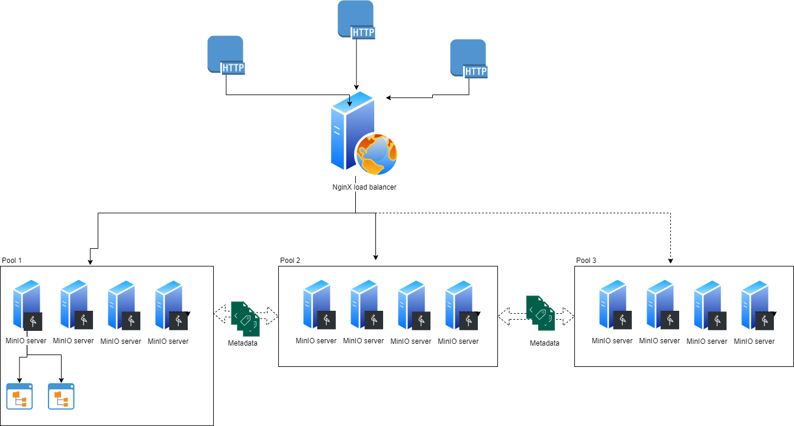

# Investigations of MinIO

- Never use the standalone setup for investigations it uses different storage structure than distributed and useless 

## Some notes about MinIO storage 
- **Data Block** is a 'chunk' of object 
- **Parity Block** is output from some logical operation(e.g XOR) between two data blocks of object 

- Efficient storage mechanism thanks to [erasure-code](https://docs.min.io/docs/minio-erasure-code-quickstart-guide)

    MinIO divides data into equal chunks(data blocks) (based on the number of data blocks in the pool), calculates parities, and stores them as well(RAID* like architecture). By default, MinIO will keep the number of data blocks and parity blocks equal, this means if we have 16 nodes cluster we will have 8 data blocks and 8 parity blocks per object. This means we have 50% effective storage. The number of parity blocks can be configured with **MINIO_STORAGE_CLASS_STANDARD** env var e.g 
    MINIO_STORAGE_CLASS_STANDARD="EC:4" to achive higher effective storage. [(more_configs)](https://docs.min.io/docs/minio-server-configuration-guide.html)
- About redundancy 

    Let's imagine we have a cluster with 8 data and 4 parity blocks. According to documentation, MinIO will run normally as long as we have 8 healthy nodes. But it is not 100 percent the case. It is starting to make some weird things on point when a number of healthy nodes(H) equal to the number of data blocks(D).
    So cluster will be ok as long as H>=D+1, cluster will not work if H<=D-1 and cluster need strict monitoring when H=D
    
- Because of Parities and erasure-code-like architecture MinIO doesn't like changeable data

    Every time when data is updated MinIO recalculates parities between chunks for the whole file 
- Doesn't like to be down 

    Every time when the data block is corrupted or gone MinIO have to calculate missed block based on existing data and parity blocks which makes retrieval of object slow  
    
Assesment against metrics that that we define you can find in [Storage_statistics.xlsx](./Storage_statistics.xlsx)

To extend MinIO capasity we can add pool to existing pool

To see single pool setup on architecture have look at [docker-compose file](./docker-compose-single-pool.yml)

In order to add pool to already existing setup the pool should mutch with topology with existing one, in [extended pool docker-compose file](./docker-compose-extended-pool.yml) you will see example of adding pool with same topologie to existing single pool cluster. 
Take into account than MinIO servers are 'aware' about each other within pool set, so doesn't matter to which server of which pool you will connect. This is perfect for using  load balancer, have look at [docker compose with NginX](./docker-compose-extended-load-balanced.yml) for more detailed info.